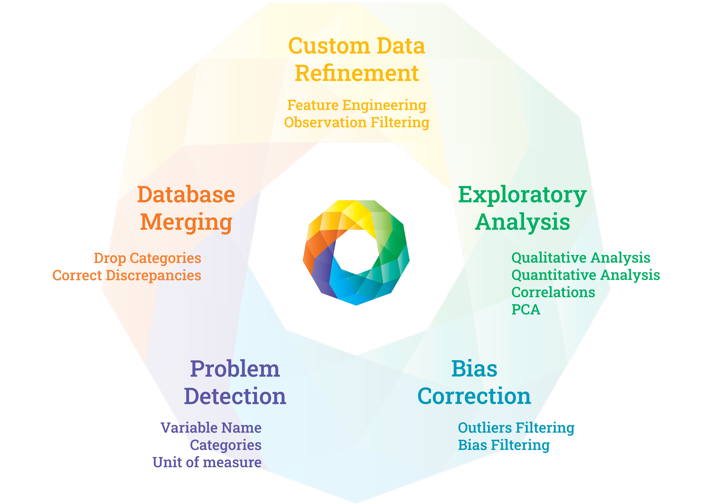

* [Introduction](#introduction)
* [Dependencies](#dependencies)
* [Getting Started](#getting-started)

## Introduction

The **ATHAR** pipeline is an end-to-end solution designed for the correction and harmonization of multiple datasets. The pipeline consists of five integrated sub-pipelines:

1. **Problem Detection** - Identifies inconsistencies across datasets
2. **Database Merging** - Combines multiple datasets systematically
3. **Custom Data Refinement** (Optional) - Allows manual adjustments
4. **Exploratory Analysis** - Provides visual and statistical insights
5. **Bias Correction** - Standardizes data for unified analysis

## Dependencies

The ATHAR package requires the following R packages:

### Core Packages
- Data Manipulation: `dplyr`, `tidyverse`, `plyr`, `stringr`, `stringdist`
- File I/O: `readxl`, `openxlsx`

### Visualization
- `ggplot2`, `ggrepel`, `ggpubr`, `viridis`, `RColorConesa`
- `corrplot`, `VennDiagram`, `UpSetR`, `lattice`, `grid`

### Analysis
- Machine Learning: `caret`, `ropls`
- Statistics: `Hmisc`, `factoextra`, `logisticPCA`, `rcompanion`

### Reporting
- `rmarkdown`, `knitr`, `kableExtra`, `tinytex`

### Parallel Processing
- `future`, `furrr`

Install all dependencies with:
```r
install.packages(c(
  "caret", "corrplot", "dplyr", "factoextra", "furrr", "future",
  "ggplot2", "ggpubr", "ggrepel", "grid", "Hmisc", "kableExtra",
  "knitr", "lattice", "logisticPCA", "openxlsx", "plyr", "RColorConesa",
  "readxl", "rmarkdown", "rcompanion", "ropls", "stringdist",
  "stringr", "tinytex", "tidyverse", "UpSetR", "VennDiagram", "viridis"
))
```

## Getting Started

The ATHAR R pipeline can be obtained directly from the GitHub repository. 

To use ATHAR, you will need to have prepared the multiple datasets that require merging and harmonization. The pipeline is executed using RStudio's "Knit with Parameters" option, where users can specify all necessary parameters, including file paths, analysis options, and locations of required functions. 

The workflow is designed sequentially, where each sub-pipeline produces outputs that automatically serve as inputs for the next stage. 

Note that during the process, the pipeline may generate intermediate Excel files (xlsx format) that users might need to review or complete manually before continuing with subsequent analysis steps.
